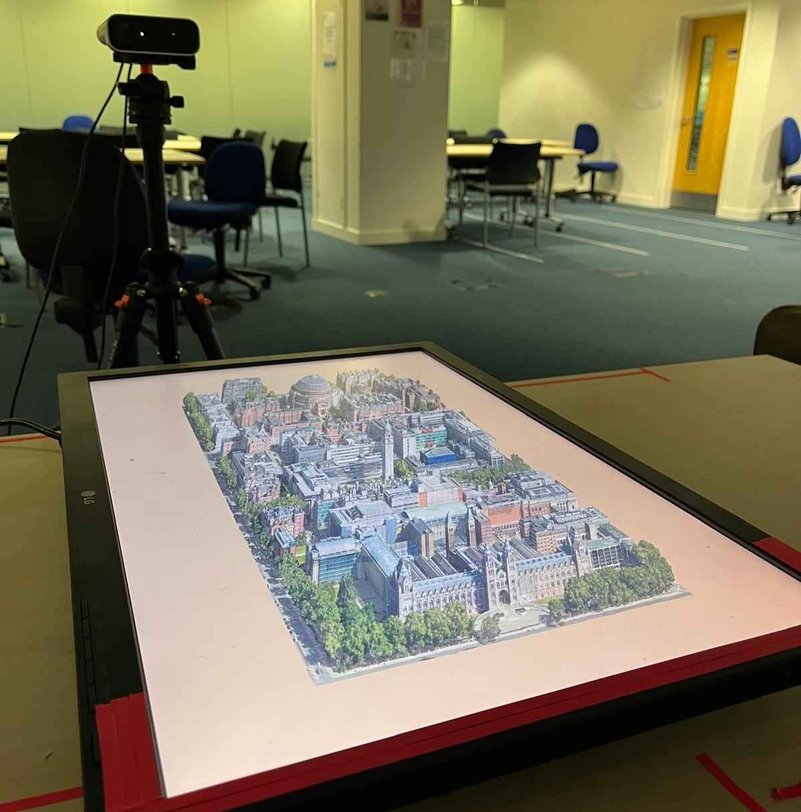

# VoluSim: A Virtual Volumetric Display



## Overview

**VoluSim** is a simulation platform for volumetric displays developed to facilitate Human-Computer Interaction (HCI) research. This project aims to provide an accessible, cost-effective, and reproducible tool for researchers to explore the potential of volumetric displays in various fields, including medical imaging, scientific visualization, and computer-aided design.

## Table of Contents

- [Motivation](#motivation)
- [Contributions](#contributions)
- [Features](#features)
- [Getting Started](#getting-started)
- [Acknowledgments](#acknowledgments)
- [License](#license)

## Motivation

Volumetric displays offer a unique approach to representing 3D objects and scenes, allowing multiple viewers to observe from any angle without special visual apparatus. Despite their potential, these displays are still emerging, with high costs and complexity limiting widespread adoption and research into their usability. VoluSim addresses these challenges by providing a simulation tool that mimics the functionality of volumetric displays, enabling researchers to conduct usability studies without the need for expensive hardware.

## Contributions

VoluSim makes two novel contributions to the field of volumetric displays:
1. **Volumetric Display Simulator**: A software-based simulator that enables HCI research on standard desktop computers.
2. **User Study**: An evaluation that demonstrates the effectiveness of the simulator in facilitating meaningful research on volumetric display usability.

## Features

- **Cost-Effective**: Operates on standard desktop hardware using regular monitors.
- **Reproducible**: Uses Nix package manager for easy replication of software environments.
- **Simple and Lightweight**: Comprised of approximately 2,000 lines of C++ code, leveraging well-established libraries.
- **Head and Hand Tracking**: Uses Microsoft's Azure Kinect Camera for intuitive 3D interaction.

## Getting Started

### Prerequisites

- A standard desktop computer with a regular monitor.
- [Azure Kinect Camera](https://www.microsoft.com/en-us/p/azure-kinect-dk/8pp5vxmd9nhq).

### Installation

Nix will configure and install all the dependencies you need so you all you need to do is: 

1. Clone the repository:

   ```bash
   git clone https://github.com/yourusername/volusim.git
	```

2. Install [Nix](https://nixos.org/) using the [Determinate Nix Installer](https://determinate.systems/posts/determinate-nix-installer/)
   ```bash
   curl --proto '=https' --tlsv1.2 -sSf -L https://install.determinate.systems/nix | sh -s -- install
   ```

### Usage

3. Build VoluSim
   ```bash
   cd VoluSim 
   nix build  
   ```
4. Run VoluSim
   ```bash
   nix develop .#userstudy
   study run demo
   ```

## Acknowledgments
- **Author:** Robert Buxton
- **Supervisor:** Dr. Nicole Salomons
- **Second Marker:** Dr. Basaran Kocer

Special thanks to Imperial College London for their support and facilities.

## License
This project is licensed under the MIT License